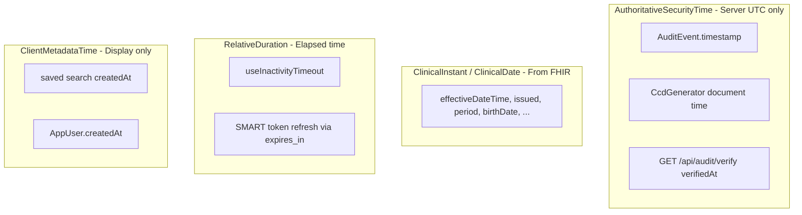

# Timekeeping Design System

Canonical rules for dates, times, and durations in fhirPlace. Aligned with:

- [HL7 FHIR Security — Time Keeping](https://www.hl7.org/fhir/security.html) (item 1)
- [FHIR Safety §7.11.3](https://www.hl7.org/fhir/safety.html#7.11.3) (date / timezone display)
- [FHIR Safety §7.11.7](https://www.hl7.org/fhir/safety.html#7.11.7) (NTP + robustness against wrong client clocks)
- [HL7 SEC — Time Keeping](https://confluence.hl7.org/display/SEC/1.+Time+Keeping) (operational guidance)

Implementation:

| Layer | Module |
|-------|--------|
| Server (authoritative) | [`server/Timekeeping.cs`](../server/Timekeeping.cs) |
| Client (display & filters) | [`src/lib/timekeeping.ts`](../src/lib/timekeeping.ts) |

---

## 1. HL7 requirements mapped to fhirPlace

| HL7 requirement | Where it applies |
|-----------------|------------------|
| Clocks synchronized with NTP/SNTP | **Deployment** — API host, reverse proxy, clinician workstations (see §5) |
| Design robust against wrong clock | **Application** — server UTC for audit/CCD; monotonic elapsed time for session timeout; ignore client audit timestamps |
| ISO 8601 interchange | All authoritative API timestamps use UTC ISO 8601 |
| Safe date display | Clinical times use named format tokens with explicit `Intl` options (month names, not ambiguous numeric-only dates) |

---

## 2. Time categories

### AuthoritativeSecurityTime

**Source:** `Timekeeping.UtcNowIso()` / `Timekeeping.UtcNow()` on the API only.

**Used for:** audit middleware, `POST /api/audit`, audit chain verification, CCD effective / author times, `GET /api/health` → `serverTimeUtc`.

**Rules:**

- Clients must not send `timestamp` on audit POST; the server ignores it if present.
- Timestamps are stored in the audit hash chain; do not rewrite after write.
- Format: .NET round-trip ISO 8601 UTC (`DateTime.ToString("o")`).

### ClinicalInstant

**Source:** FHIR `instant` / `dateTime` strings from the API (unchanged).

**Rules:**

- Parse as ISO 8601; display via `formatClinicalDateTime` (or `formatClinicalDate` when time is absent).
- Do not persist display-formatted strings back to the server.
- Render in the user’s locale/timezone using explicit `Intl` options (see §4).

### ClinicalDate

**Source:** FHIR `date` (no time component).

**Rules:**

- Use `formatClinicalDate` — date-only options, no `hour`/`minute`.
- Avoid operations that shift calendar day across timezones when the input is date-only.

### RelativeDuration

**Source:** Monotonic clock or OAuth-relative seconds — not wall-clock “now”.

**Used for:** 15-minute inactivity timeout, SMART `expires_in` refresh scheduling.

**Rules:**

- Inactivity: use `monotonicNow()` and elapsed deltas (`performance.now()`), not `Date.now()` comparisons for security timeout duration.
- OAuth: schedule refresh from `expires_in` returned by the authorization server; EHR is authoritative for token validity.

### ClientMetadataTime

**Source:** `clientMetadataNowIso()` on the client.

**Used for:** saved-search `createdAt`, profile “session started” display.

**Rules:**

- Display-only; never used for audit evidence, access control, or clinical decisions.
- May disagree with server time if the workstation clock is wrong — acceptable for UI metadata only.

### OpaqueId (out of scope)

`Date.now()` used as React list keys (e.g. chat messages) is an identifier, not a clinical or security timestamp.

---

## 3. Normative rules

1. **One server clock** — all `AuthoritativeSecurityTime` values come from `Timekeeping` in `server/`.
2. **Reject client audit times** — `POST /api/audit` always sets `Timestamp` on the server.
3. **One client display module** — new UI code imports from `src/lib/timekeeping.ts`; no per-component copy-paste `fmt` helpers.
4. **Audit filters** — use `auditFilterRangeToUtc()` to convert HTML date inputs to UTC ISO bounds before querying `/api/audit`.
5. **Health check** — operators compare `GET /api/health` → `serverTimeUtc` against NTP; the app does not call external NTP servers.
6. **FHIR safety (dates)** — prefer formats that include the month name; avoid ambiguous `D/M/Y` vs `M/D/Y` in user-visible strings.

---

## 4. Format catalog (design tokens)

| Token | Function | Typical use |
|-------|----------|-------------|
| `clinicalDateTime` | `formatClinicalDateTime` | Observations, encounters, conditions |
| `clinicalDate` | `formatClinicalDate` | Date-only fields, timeline axes |
| `clinicalMonthShort` | `formatClinicalMonthShort` | Compact chart labels |
| `auditDateTime` | `formatAuditDateTime` | Audit log table |
| `duration` | `formatDuration` | Procedure / encounter length |

Example (en-US locale): `Jan 15, 2024, 3:45 PM` for `clinicalDateTime`.

Legacy aliases `fmtDateTime` and `shortMonth` remain until all views migrate.

---

## 5. Deployment — NTP / SNTP

fhirPlace does not run an in-container NTP daemon. Clock sync is an **infrastructure** responsibility:

| Environment | Guidance |
|-------------|----------|
| Linux API host | `chronyd` or `systemd-timesyncd`; verify with `timedatectl status` |
| Windows server | Windows Time service (w32time) |
| Docker | Container inherits host clock; sync the **host** |
| Cloud (Azure/AWS/GCP) | Use provider hypervisor time sync |
| Clinician browsers | Workstation OS time sync (SMART OAuth `exp` / `nbf` rely on correct client clock) |

Optional ops target: [IHE Consistent Time (CT)](https://profiles.ihe.net/ITI/TF/Volume1/ch-7.html) median error &lt; 1 second.

Self-managed NTP may require outbound **UDP 123** on the API host; see [Network Requirements](./network-requirements.md).

---

## 6. Migration status

| Area | Status |
|------|--------|
| Design system doc | Done |
| `server/Timekeeping.cs` + audit/health/CCD | Done |
| `src/lib/timekeeping.ts` (core API) | Done |
| `useInactivityTimeout` → `monotonicNow` | Done |
| `AuditLogPage` → shared formatters / filters | Done |
| View `fmt` consolidation (`formatUtils` → clinical formatters) | **Follow-up** |

**Ops:** Compare `GET /api/health` → `serverTimeUtc` with `w32tm /query /status` (Windows) or `chronyc tracking` (Linux).

---

## 7. Related documentation

- [ONC compliance — §170.315(d)(2)](./onc-compliance.md)
- [API Reference — GET /api/health](./api-reference.md)
- [Architecture — Security controls](./architecture.md)
- [AGENTS.md](../AGENTS.md) — agent checklist
